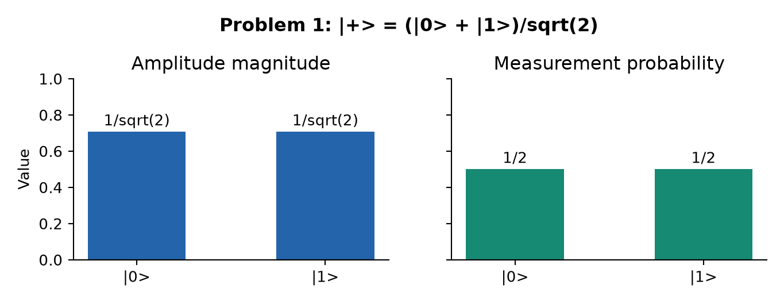
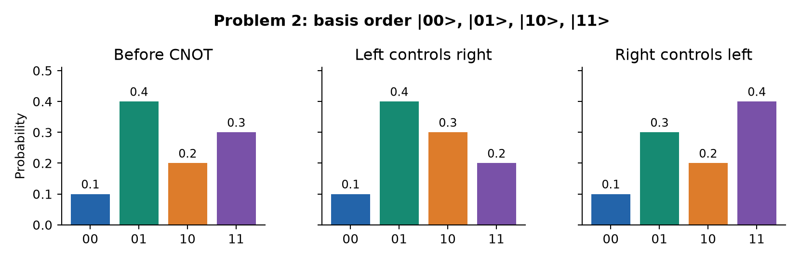
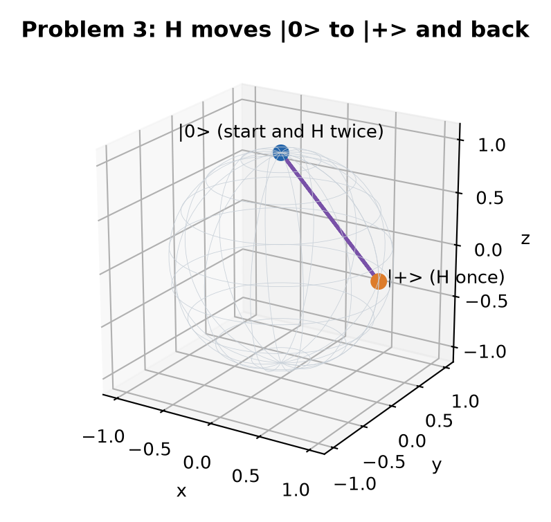
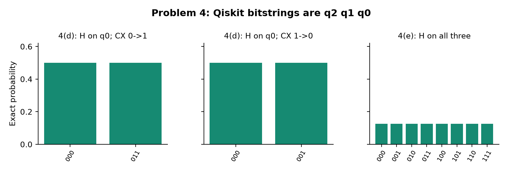
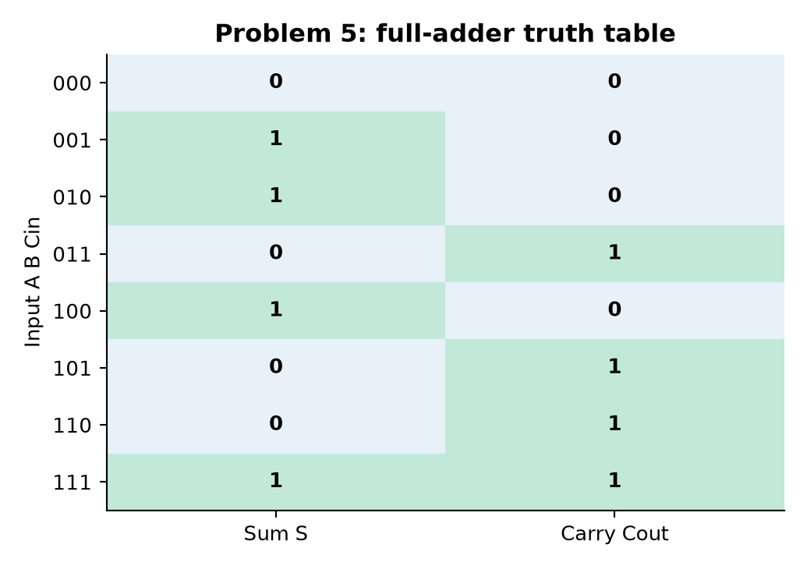
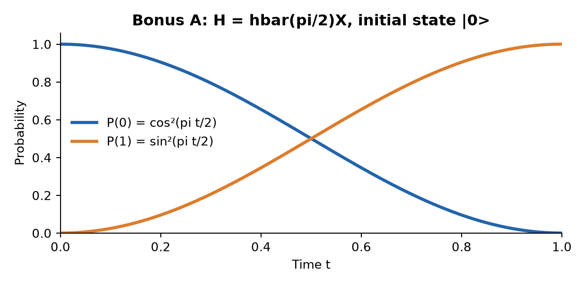
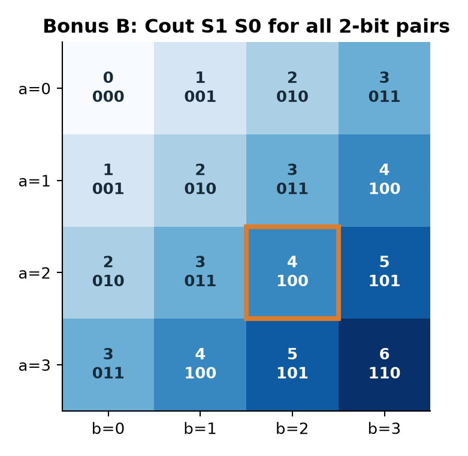

# CSCI739 Homework 1 — Expert-Assessment Version

**Name:** Piter Garcia  
**Date:** October 6, 2026

**Basis convention:** written kets use \(\lvert q_0q_1\cdots\rangle\); Qiskit count strings are mapped explicitly below. The [comprehensive reference](./Homework_1-Comprehensive-Learning-Reference.md) gives the extended derivations and [verification notebook](./Homework_1-Qiskit-Verification.ipynb) contains runnable circuits.

## Problem 1 — Qubit Basics

For \(\lvert\psi\rangle=\alpha\lvert0\rangle+\beta\lvert1\rangle\), orthonormality gives
\[
\langle0|\psi\rangle=\alpha\langle0|0\rangle+\beta\langle0|1\rangle=\alpha,\qquad
\langle1|\psi\rangle=\alpha\langle1|0\rangle+\beta\langle1|1\rangle=\beta.
\]
By the Born rule, \(P(0)=|\langle0|\psi\rangle|^2=|\alpha|^2\) and \(P(1)=|\langle1|\psi\rangle|^2=|\beta|^2\). The supplied norm condition makes \(P(0)+P(1)=1\). For \((\lvert0\rangle+\lvert1\rangle)/\sqrt2\), each probability is \(1/2\). Independently, \(\langle\psi|\psi\rangle=(\alpha^*,\beta^*)(\alpha,\beta)^T=1\); in the example it is \(1/2+1/2=1\). The complex amplitudes are not themselves probabilities, and these values refer specifically to computational-basis measurement.

## Problem 2 — Two-Qubit Systems and CNOT

Use basis order \((|00\rangle,|01\rangle,|10\rangle,|11\rangle)\). The tensor products \(|0\rangle\otimes|0\rangle,\ |0\rangle\otimes|1\rangle,\ |1\rangle\otimes|0\rangle,\ |1\rangle\otimes|1\rangle\) are respectively
\[
|00\rangle=\begin{pmatrix}1\\0\\0\\0\end{pmatrix},\quad
|01\rangle=\begin{pmatrix}0\\1\\0\\0\end{pmatrix},\quad
|10\rangle=\begin{pmatrix}0\\0\\1\\0\end{pmatrix},\quad
|11\rangle=\begin{pmatrix}0\\0\\0\\1\end{pmatrix}.
\]

For the given state, \(\|\psi\|^2=(1+4+2+3)/10=1\) and the outcome probabilities in that order are \((1,4,2,3)/10\). Left-control/right-target CNOT maps \(00\to00,\ 01\to01,\ 10\to11,\ 11\to10\). It therefore exchanges the last two **amplitudes**, giving post-gate probabilities \((1,4,3,2)/10\).

With the right qubit controlling the left, \(|ab\rangle\mapsto|a\oplus b,b\rangle\), so \(00\to00,\ 01\to11,\ 10\to10,\ 11\to01\). Taking each output as a matrix column gives
\[
U_{R\to L}=\begin{pmatrix}1&0&0&0\\0&0&0&1\\0&0&1&0\\0&1&0&0\end{pmatrix}.
\]
This real symmetric permutation matrix has \(U^\dagger=U\) and \(U^2=I_4\): it swaps \(01\leftrightarrow11\) and fixes the other two basis states. Thus \(U^\dagger U=I_4\), proving unitarity for every input; the unchanged probability sum alone would not suffice.

## Problem 3 — Bloch Sphere and Single-Qubit Gates

For normalized \((\alpha,\beta)\), remove the global phase of nonzero \(\alpha\). The canonical amplitudes become \((|\alpha|,e^{i(\arg\beta-\arg\alpha)}|\beta|)\), so
\[
\theta=2\operatorname{atan2}(|\beta|,|\alpha|),\qquad
\phi=(\arg\beta-\arg\alpha)\bmod2\pi
\]
when both amplitudes are nonzero. \(|0\rangle\) has \(\theta=0\), \(|1\rangle\) has \(\theta=\pi\); \(\phi\) is arbitrary at both poles.

Writing \(\mathbf r=(\sin\theta\cos\phi,\sin\theta\sin\phi,\cos\theta)\), the requested gate actions are:

| Gate | Output amplitudes | Bloch action | Immediate Z-basis probabilities |
|---|---|---|---|
| X | \((\beta,\alpha)\) | \((r_x,-r_y,-r_z)\), angles \((\pi-\theta,-\phi)\) | \((|\beta|^2,|\alpha|^2)\) |
| Y | \((-i\beta,i\alpha)\) | \((-r_x,r_y,-r_z)\), angles \((\pi-\theta,\pi-\phi)\) | \((|\beta|^2,|\alpha|^2)\) |
| Z | \((\alpha,-\beta)\) | \((-r_x,-r_y,r_z)\), angles \((\theta,\phi+\pi)\) | unchanged |
| \(P(\hat\theta)\) | \((\alpha,e^{i\hat\theta}\beta)\) | z rotation, angles \((\theta,\phi+\hat\theta)\) | unchanged |
| H | \(((\alpha+\beta)/\sqrt2,(\alpha-\beta)/\sqrt2)\) | \((r_z,-r_y,r_x)\); \(\theta'=\arccos r_x,\ \phi'=\operatorname{atan2}(-r_y,r_z)\) off poles | \((\tfrac12+\operatorname{Re}\alpha^*\beta,\tfrac12-\operatorname{Re}\alpha^*\beta)\) |

Angles are modulo \(2\pi\), with azimuth arbitrary at a pole. Z and \(P\) can change **relative phase** despite leaving direct Z probabilities fixed; H can make that phase observable through \(\operatorname{Re}(\alpha^*\beta)\). A phase multiplying an entire ket is global and has no measurement effect.

Finally,
\[
H|0\rangle=(|0\rangle+|1\rangle)/\sqrt2,\quad
H^2|0\rangle=\tfrac12[(|0\rangle+|1\rangle)+(|0\rangle-|1\rangle)]=|0\rangle.
\]
The \(|0\rangle\) amplitudes reinforce and the \(|1\rangle\) amplitudes cancel. The final state is a definite basis state. Matrix multiplication independently gives \(H^2=I\).

## Problem 4 — Tensor Products to Qiskit Circuits

The product-operator identity gives
\[
(H\otimes H)|00\rangle=(H|0\rangle)\otimes(H|0\rangle)
=|++\rangle=\tfrac12(|00\rangle+|01\rangle+|10\rangle+|11\rangle).
\]
By repeated application, \((\bigotimes_jU_j)(\bigotimes_j|\psi_j\rangle)=\bigotimes_jU_j|\psi_j\rangle\), and tensoring unitaries preserves unitarity because \((\bigotimes_jU_j)^\dagger(\bigotimes_jU_j)=\bigotimes_jI=I\). A joint CNOT then acts branchwise. The [executed notebook](./Homework_1-Qiskit-Verification.ipynb) implements all requested circuits.

For part (d), written ket order \(q_0q_1q_2\): \(H\) on \(q_0\) alone means \(H\otimes I\otimes I\), producing \((|000\rangle+|100\rangle)/\sqrt2\). CNOT(0→1) yields \((|000\rangle+|110\rangle)/\sqrt2\); CNOT(1→0) leaves the state unchanged because \(q_1=0\) in both branches. For part (e), H on all three gives \(|+++\rangle\). Since \(X|+\rangle=|+\rangle\), either CNOT direction leaves that **product state** unchanged; this does not equate the two gates on arbitrary inputs.

**Ideal Aer verification, 1024 shots, seed 739.** Theoretical probabilities for both-H on two qubits are \(1/4\) each; printed \(q_1q_0\) counts were \(00:257,\ 01:255,\ 10:266,\ 11:246\). In part (d), printed \(q_2q_1q_0\) counts were Case 1 \(000:521,\ 011:503\) and Case 2 \(000:521,\ 001:503\), versus \(1/2\) each expected. In part (e), both circuits had equivalent statevectors and identical printed counts \(000:139,\ 001:124,\ 010:127,\ 011:134,\ 100:131,\ 101:127,\ 110:124,\ 111:118\), versus \(1/8\) each expected. Qiskit \(011\) in Case 1 represents written \(|110\rangle\).

The circuit code uses H on the stated wire and \(\mathrm{cx}(control,target)\), measures \(q_j\) into \(c_j\), and checks statevectors as well as counts. Finite-shot frequency variation does not change the exact state conclusions.

## Problem 5 — Half and Full Quantum Adders

The pinned diagrams specify half-adder gates CCX(0,1,2), CX(0,1), giving \(|A,B,0\rangle\mapsto|A,A\oplus B,AB\rangle\). Thus \(|110\rangle\to|111\rangle\to\boxed{|101\rangle}\): \(S=0,C=1\).

The full-adder gates are CCX(0,1,3), CX(0,1), CCX(1,2,3), CX(1,2), CX(0,1). After the first two gates \(q_3=AB,\ q_1=t=A\oplus B\). The next two make \(q_3=AB\oplus tC_{in}=AB\lor tC_{in}\) and \(q_2=C_{in}\oplus t=S\); the final CX restores \(q_1=B\). The XOR equals OR because \(AB\) and \(tC_{in}\) cannot both be 1. For the requested input, the full trace is
\[
|1100\rangle\to|1101\rangle\to|1001\rangle\to|1001\rangle\to|1001\rangle\to\boxed{|1101\rangle},
\]
so \(S=0,C_{out}=1\). These are premeasurement basis states.

The [executed Qiskit notebook](./Homework_1-Qiskit-Verification.ipynb) prepares A/B by conditional X, initializes the carry targets at 0, follows both diagrams, and measures half \(q_1\to c_0=S,\ q_2\to c_1=C\); full \(q_2\to c_0=S,\ q_3\to c_1=C_{out}\). Thus printed strings are \(c_1c_0=CS\).

| Input \(AB\), with \(C_{in}=0\) | Expected \((S,C)\) | Half printed counts | Full printed counts |
|---|---|---|---|
| 00 | (0,0) | 00:1024 | 00:1024 |
| 01 | (1,0) | 01:1024 | 01:1024 |
| 10 | (1,0) | 01:1024 | 01:1024 |
| 11 | (0,1) | 10:1024 | 10:1024 |

Ideal Aer simulation (1024 shots, seed 739) matched every predicted basis output. As an extra carry-in check, full-adder inputs 001, 011, 101, 111 printed respectively 01, 10, 10, 11, all at 1024 shots.

## Bonus A — Time-Dependent Schrödinger Dynamics and Quantum Control

Let $A(t)=-(i/\hbar)\int_0^tH(\tau)d\tau$, so $U(t)=e^{A(t)}$. The assumed $[H(t),H(t')]=0$ implies $[A,A']=0$; thus $U'=A'U=-(i/\hbar)HU$. Consequently $i\hbar\partial_t(U|\psi(0)\rangle)=HU|\psi(0)\rangle$, and $U(0)=I$ gives the initial condition. Without all-times commutation, a time-ordered exponential is required.

Hermitian $H(t)$ makes $A^\dagger=-A$. Therefore $U^\dagger=e^{-A}$ and $U^\dagger U=UU^\dagger=I$. For $H=\hbar\Omega X$, real $\Omega$, use $X^2=I$ to obtain

$$
U(t)=e^{-i\Omega tX}=\cos(\Omega t)I-i\sin(\Omega t)X
=\begin{pmatrix}\cos\Omega t&-i\sin\Omega t\\-i\sin\Omega t&\cos\Omega t\end{pmatrix}.
$$

Choosing $\Omega=\pi/2$ gives $U(1)=-iX$ and $|\psi(1)\rangle=-i(\beta|0\rangle+\alpha|1\rangle)$. The output probabilities $(|\beta|^2,|\alpha|^2)$ sum to one. The effective gate is Pauli $X$ up to global phase. The notebook independently checks unitarity, the Schrödinger derivative, and normalization for complex amplitudes.

## Bonus B — Two-Bit Ripple-Carry Addition of 2 + 2

Use $(q_0,q_1,q_2,q_3,q_4,q_5)=(a_0,a_1,b_0,b_1,c_1,c_{out})$, with low bits $a_0,b_0$. Both carry/work qubits start at zero. Prepare $a=b=2=10_2$ by applying X on $q_1,q_3$; written in $q_0\cdots q_5$ order, the input is $|010100\rangle$. Its $a_0a_1$ and $b_0b_1$ segments are each $|01\rangle$, consistent with the instructor's bit-order warning.

The low half-adder stage CCX(0,2,4), CX(0,2) makes $q_2=s_0=a_0\oplus b_0$ and $q_4=c_1=a_0b_0$. The high full-adder stage CCX(1,3,5), CX(1,3), CCX(3,4,5), CX(3,4), CX(1,3) consumes that $c_1$ and makes $q_4=s_1=a_1\oplus b_1\oplus c_1$, $q_5=c_{out}=a_1b_1\oplus(a_1\oplus b_1)c_1$, restoring $q_3=b_1$. The low-stage carry feeds the high stage.

For 2+2, the low stage computes $0+0\to(s_0,c_1)=(0,0)$; the high stage computes $1+1+0\to(s_1,c_{out})=(0,1)$. The full ket evolves

$$
|010100\rangle\to|010100\rangle\to|010101\rangle\to|010001\rangle\to|010001\rangle\to|010001\rangle\to|010101\rangle.
$$

Measure $q_2\to c_0=s_0$, $q_4\to c_1=s_1$, $q_5\to c_2=c_{out}$. Qiskit displays $c_2c_1c_0=100_2=4$, although the output tuple $(s_0,s_1,c_{out})$ is $(0,0,1)$. The ideal simulator returned `{'100': 1024}` (1024 shots, seed 739); statevector checks also passed all 16 input pairs $a,b\in\{0,1,2,3\}$. The optional hardware run was not performed.

## Verification and assessment notes

The Problem 4/5 and Bonus A/B code and saved ideal simulator output are in [Homework_1-Qiskit-Verification.ipynb](./Homework_1-Qiskit-Verification.ipynb). Problems 1–3 were independently checked by vector/matrix and normalization identities. Problems 4–5 and the bonuses were checked analytically; circuit results were checked with statevectors and counts. Bonus A's differential equation and unitarity were checked numerically, and Bonus B's full input table was checked. One source-scope question remains: the Problem 5 summary uses “ripple-carry” for a single full-adder stage, whereas Bonus B assigns the two-bit chain.

**AI-use record:** AI assistance was used to review my existing written and coded work, study the course lectures and notes, map and reference relevant material for each problem and bonus, and automate preparation of this document.
